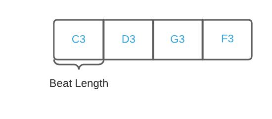

# Getting Started

This getting started session is intended to demonstrate what you can do with Phrasa, without getting too deep into syntax and terms. If you feel confused at some part, don't worry, in the next <u>Concepts</u> section we will start right at the beginning and explore Phrasa in much more detail.

This guide presumes you have a minimal understanding about music and sound. If you are unfamiliar with terms like frequency, scales or tempo you might want to begin with <u>Phrasa's Music & Sound Cheatsheet</u>, or jump to it at any time.


## Installation

Before we begin, make sure you download and install 'Phrasa Control' from [here](https://github.com/progressive-instruments/phrasa-control/releases/download/v0.1.0/phrasa-control-v0.1.0-win64.zip).

<u>**Keep in mind**</u> 
This version of Phrasa Control is highly limited, experimental and unmatured - expect some great things to come in the very near future.


## Hello Sound

Ok, let's play some sound.

Open Phrasa Control app, type the following text and press the  button:
``` phrasa linenums="1"
tempo 102bpm
beat
instrument plain
event
  frequency 440
  end 50%
```
We defined and played the most basic Phrasa structure - a single section containing a single event being played repeatedly.

The first expression `tempo 102bpm` sets `tempo` to 120 beat per minutes.

The second line `beat` defines this base section as the beat length. (it will make sense shortly).

The third line defines the instrument to be played, in this case it's name is `plain`. You can try and replace it with any other synth instrument in [this list](synths.md)

Finally, we define a musical `event` that contains the following properties:

* Frequency of 440 hertz
* End time of 50% the section length.


## Sections

Let's make things slightly more interesting with multiple sections and musical notes:

``` phrasa linenums="1"
tempo 240bpm
instrument jupiter-8
sections.1.event.note C4
sections.2.event.note D3
sections.3.event.note G3
sections.4.event.note F3
sections.1 beat
```

In lines 3-6, we divide the piece into 4 musical sections, each contains an event to be sent to the instrument`jupiter-8` with the property `note`. Here is an illustration of the piece sections:


A 'section' is a fixed time frame where events can occur. As we'll see later, each section can be divided into more inner sections, allowing us to create an hierarchical musical structure.

The final expression `sections.1 beat` defines the first section as the beat length of the piece (see the picture above). It means that the tempo (in this case 135 beats per minute) will be relative to the duration of the first section.

To make our code a bit less repetitive we can use the mighty selector symbol - `#`:

``` phrasa linenums="1"
instrument jupiter-8
sections.#.event.note
  1 C5
  2 D3
  3 G3
  4 F3
```


## Harmony

Phrasa provides you with tools to write music with musical concepts in mind, for example <span style="color:blueviolet;font-size:120%">**<u>Relativity</u>**</span> - a core abstract concept that underline chords, scales, rhythms and many other applications. 

In this example, instead of writing down the actual note as we did before, we can write the offset in relation to its harmonic context:

``` phrasa linenums="1"
tempo 135bpm
sections.1 beat
instrument jupiter-8
pitch.grid (chord b-min)
pitch.zone b3

sections.total 8
sections.#.event.pitch
  1 -3
  2 0
  4 3
  7 4
```

Lines 4-5 define the harmonic context:

* `pitch.grid` defines the set of notes, in this case 'B minor' chord in all octaves.
* `pitch.zone` defines the initial position within the grid. In this case, the note 'B' in the 3rd octave.

The expression `sections.total 8` sets the total number of sections to 8 (if this property is not set, the total number of sections will be equal to the last section assigned)

In lines 9-13 we set events for sections 1,4,6 and 7 with the property `pitch`. The value of `pitch` defines the offset within the previously defined harmonic context.


## Reusing Patterns

Another example for a core musical concept that can be manipulated with Phrasa is <span style="color:blueviolet;font-size:120%">**<u>Repetition</u>**</span>. 

It is probably the most notable element of music, right there within the physical nature of any periodic sound. Music without repetition is just pure random sound, or more technically - noise (by itself a crucial element in music). 

With Phrasa you can reuse repeated elements in different ways. One way is to define multiple sections in a single expression: `sections.x-y` or `sections.x,y`, and then make variations over them:

``` phrasa linenums="1"
tempo 127bpm
instrument jupiter-8
pitch
  grid (chord c-maj)
  zone g4
  
sections.1-4
  sections.1 beat
  sections.1-4.sections.#.event.pitch 
    2 0
    4 1
  sections.#.sections.3.event.pitch
    1 -1
    2 2

sections.3-4.pitch.grid (chord g-maj)
```

By setting multiple sections collectively, we are keeping all their shared properties in one place and make our piece much more flexible.

In this example we're using multiple sections within sections, Here is a diagram that illustrates the resulted sections and and events:


Imagine how hard you had to work writing these events one by one, and even harder if you wanted to make a change. This is the power of reusability.


## Sequencing

We shall now explore another fundamental musical concept, tightly related to the way we perceive time - <span style="color:blueviolet;font-size:120%">**Continuity**</span>.

In order to play with continuity in music, we are going to use our good old friend - the sequencer:

``` phrasa linenums="1"
tempo 125bpm
instrument attacky
pitch
  grid (scale g-maj)
  zone g3

sequences.ascending 1,3,4,5,7
sections.1-4
  beat
  sections.1,3,4.event.pitch (sequences.ascending >)

sections.4.pitch.grid (scale d-maj)
```

In line 7, we define multiple values to the sequence by the name of `ascending`. 

In line 10 we assign the expression `(sequences.ascending >)` to the the property `pitch`. Each of the events assigned to this expression, will increment the sequence position by one (as indicated by the symbol `>`) and use the current value of the sequence.

Here is an illustration of the outcome:


## Multiple Instruments

So we've made all these super cool stuff with a single instrument, now we'll branch out and have multiple instruments play together.

Also, to make our code more readable and manageable we're gonna write down the piece in multiple files. Add 2 files by clicking the    button and type the following text for each file:

``` phrasa linenums="1"
tempo 130bpm
pitch
  grid (scale g-maj)
  zone g3

use Phrase-1
use Phrase-2
```
`Base-Phrase`


``` phrasa linenums="1"
branches.cymbals
  instrument drums
  sections.1-8
    sections.#.event
      1 (sample hat-closed)
      2 (sample stick), (end 10%)
branches.kicks
  instrument drums
  sections.total 16
  sections.1,5,8,14.event
    sample kick
  sections.5,8.event
    sample snare
```

`Phrase-1`


``` phrasa linenums="1"
branches.bass
  instrument bass-8
  sequences.ascending 1,3,4,5,7
  sections.1-4
    beat
    sections.1-4.event.pitch (sequences.ascending >)

  sections.4.pitch.grid (scale d-maj)
```

`Phrase-2`


The file `Base-Phrase` is the base section of the piece, defines the base pitch and tempo.

The `use` expressions import the entire content of the 2 external `phrase` files. 

In the 2 phrase files we created `branches` by the names: `cymbals`, `kicks` and `bass`. 

A branch is a new section derived from the context of it's parent section, taking it's own path with it's own inner sections, sequences and other things. It gives you the freedom to create multiple parallel structures and define events within each of them.

In `Phrase-1` we are using a sampler instrument by the name of `drums`. Events for sampler instruments contain the property `sample` which sets the desired sample to be played.

Try out and replace `drums` it with any other sampler instrument in [this list](sampler.md)


## Summarizing

I hope now you have a much better understanding of what can be done with Phrasa.

I advise you to try and extend the examples you've seen in this tutorial, and whenever you're ready - go deeper into <u>Concepts</u>, where you'll find everything you need to know about the language.

Enjoy the ride :)

