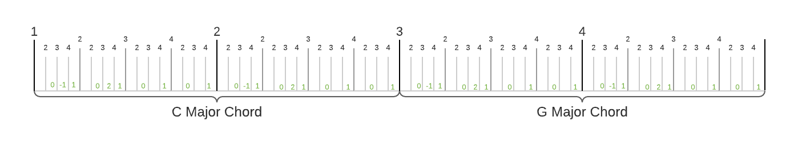

# Getting Started

This getting started session is intended to demonstrate what you can do with Phrasa, without getting too deep into syntax and terms. If you feel confused at some part, don't worry, in the next <u>Concepts</u> section we will start right at the beginning and explore Phrasa in much more detail.

This guide presumes you have a minimal understanding about music and sound. If you are unfamiliar with terms like frequency, scales or tempo you might want to begin with <u>Phrasa's Music & Sound Cheatsheet</u>, or jump to it at any time.


## Installation

Before we begin, you should download and install Phrasa Control from [here](https://github.com/progressive-instruments/phrasa-control/releases/download/v0.1.0/phrasa-control-v0.1.0-win64.zip).

<u>**Keep in mind**</u> 
This version of Phrasa Control is limited, experimental and unmatured - expect great things to come in the very near future.


## Hello Sound

Ok, let's play sound.

Open 'Phrasa Control', type the following text and press on the play button:
``` phrasa linenums="1"
tempo 102bpm
beat
instrument plain
event
  frequency 440
  end 50%
```
We defined and played the most basic Phrasa structure - a single section containing a single event playing repeatedly.

The first expression `tempo 102bpm` sets `tempo` to `102bpm`.

The second line `beat` defines this section as the beat length. (it will make more sense in the next section).

In the third line we define the instrument to be played, in this case it's name is `plain`. You can try other instruments listed in here....... 

Then we define a musical `event` that contains the following properties:

* Frequency of 440 hertz
* End time of 50% the section length.


## Sections

Let's make things slightly more interesting, adding some notes to be played:

``` phrasa linenums="1"
tempo 240bpm
instrument jupiter-8
sections.1.event.note C4
sections.2.event.note D3
sections.3.event.note G3
sections.4.event.note F3
sections.1 beat
```

In lines 3-6, we divide the piece into 4 musical sections, each contains an event to be sent to the instrument`jupiter-8` with the property `note`. Here is an illustration of the piece sections:


A 'section' is a fixed time frame where events can occur. Every section can be divided into inner sections.

The final expression `sections.1 beat` defines the first section as the beat length of the piece (see picture above). It means that the tempo (in this case 135 beats per minute) will be relative to the duration of this section.

To make our code a bit less repetitive we can use the mighty selector symbol - `#`:

``` phrasa linenums="1"
instrument jupiter-8
sections.#.event.note
  1 C5
  2 D3
  3 G3
  4 F3
```


## Harmony

Phrasa provides you with tools to write music with musical concepts in mind. One example is <span style="color:blueviolet;font-size:120%">**<u>Relativity</u>**</span> - a core abstract concept that underline chords, scales, rhythms and many other applications. 

In this example, instead of writing down the actual note as we did before, we can write the offset in relation to its harmonic context:

``` phrasa linenums="1"
tempo 135bpm
sections.1 beat
instrument jupiter-8
pitch.grid (chord b-min)
pitch.zone b3

sections.total 8
sections.#.event.pitch
  1 -3
  2 0
  4 3
  7 4
```

Lines 4-5 define the harmonic context.

`pitch.grid` defines the set of notes, in this case 'B minor' chord in all octaves.

`pitch.zone` defines the initial position within the grid. In this case, the note 'B' in the 3rd octave.

The expression `sections.total 8` sets the total number of sections to 8 (if this property is not set, total sections will be equal to the last section assigned)

In lines 9-13 we set events for sections 1,4,6 and 7.

The value of `pitch` defines the offset within the previously defined harmonic context.


## Reusing Patterns

Another example for a core musical concept is <span style="color:blueviolet;font-size:120%">**<u>Repetition</u>**</span>. It is probably the most notable element of music, right there within the physical nature of any periodic sound. Music without repetition is pure random sound, or more technically - noise. 

In Phrasa you can reuse repeated elements in different ways. One way define multiple sections in a single expression: `sections.x-y` or `sections.x,y`, and then make variations over them:

``` phrasa linenums="1"
tempo 127bpm
instrument jupiter-8
pitch
  grid (chord c-maj)
  zone g4
  
sections.1-4
  sections.1 beat
  sections.1-4.sections.#.event.pitch 
    2 0
    4 1
  sections.#.sections.3.event.pitch
    1 -1
    2 2

sections.3-4.pitch.grid (chord g-maj)
```

By setting multiple sections collectively, we are keeping all their shared properties in one place. This will make our piece much more flexible.

Here is a diagram that illustrates the resulted sections and and events:



Imagine how hard you had to work writing these events one by one, and even harder if you wanted to make a change. This is the power of reusability.


## Sequencing

Until now we have played with musical elements based on the concepts of hierarchy and repetition. Now let's play with another fundamental concept of perceiving time - **continuity**.

For this we have our old pal - the sequencer:

``` phrasa linenums="1"
tempo 125bpm
instrument jupiter-8
pitch
  grid (scale g-maj)
  zone g3
  
sequences.ascending 1,3,4,5,7
sections.1-4
  beat
  sections.1-4.event.pitch (sequences.ascending >)

sections.4.pitch.grid (scale d-maj)
```

In line 7 we defines a sequence of values by the name `ascending`. 

In line 10 we assign the expression `(sequences.ascending >)` to the the property `pitch`. Each of the events assigned to this expression, will increment the sequence position by one (as indicated by the symbol `>`) and use the current value of the sequence.

Here is an illustration of the outcome:


## Multiple Instruments

<span style="color:red">**<u>Not supported</u>**</span>.

So we had all these cool stuff with a single instrument, so let's branch out and have multiple instruments playing together. 

Also, to make our code more readable and manageable we're gonna write down the piece in multiple files:

``` phrasa linenums="1"
tempo 130bpm
pitch
  grid (scale g-maj)
  zone g3

use drums
use bass
```
`cool.piece`


``` phrasa linenums="1"
branches.cymbals
  instrument drums
  sections.1-8
    sections.#.event.sample
      1 cym1
      2 cym2
branches.kicks
  sections.total 16
  sections.1 beat
  sections.1,5,8,14.drums.event
    sample kick
  sections.5,8.drums.event
    sample snare
```

`drums.motif`


``` phrasa linenums="1"
branches.bass
  instrument bass-8
  sequences.ascending 1,3,4,5,7
  sections.1-4
    beat
    sections.1-4.event.pitch (sequences.ascending >)

  sections.4.pitch.grid (scale d-maj)
```

`bass.motif`


The main file of this piece is `cool.piece` which defines the base pitch and tempo.

The `use` expressions import the entire content of an external .motif file. 

In the motif files we created 3 branches: `cymbals`, `kicks` and `bass`. A branch is a new section derived from the context of it's parent section, taking it's own path with it's own inner sections, sequences and other things. It gives you the freedom to create multiple parallel structures and define events within each of them.

