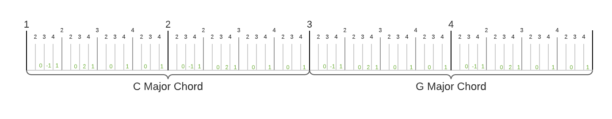
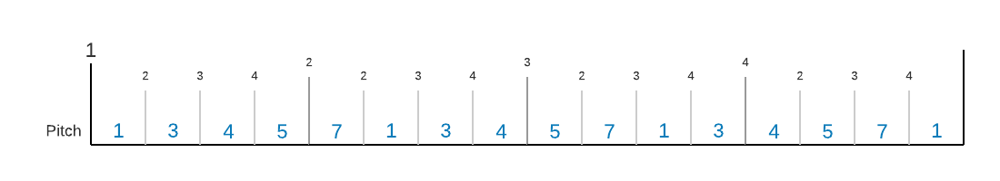

# Getting Started

This getting started session is intended to give you an overview over the capabilities of Phrasa. If you feel confused at some part, don't worry, In the next 'Concepts' section we will start right at the beginning.

This guide presumes you have some minimal understanding about music and sound. If you are unfamiliar with terms like fequency, note or tempo you might want to begin with <u>Phrasa Music and Sound Cheatsheet</u>, or jump to it at any time you feel.


## Hello Sound

Ok, let's play our first sound.

Open 'Phrasa Control' and type the following text:
``` phrasa linenums="1"
tempo 102bpm
beat
lead.event
  frequency 440
  end 50%
```
We defined and played the most basic Phrasa structure - a single musical phrase containing a single event playing repeatedly.

Now let's open up the text.

The first expression is `tempo 120bpm` assigns the value `120bpm` to the subject `tempo`. The subject and the value are separated with space.

The second line is `beat` which I'll explain in the next section.

Next we have a 3 lines expression that assign a musical `event` to an instrument by the name of `lead` with the following properties:
* Frequency of 440 hertz
* End time of 50% the phrase length.

In this case, the expression's subject is `lead.event` and the expression's input are 2 other expressions `frequency 440` and `end 50%`, separated from the subject by a new line and a higher indentation level. 

To short things up we can replace the expression subject `lead.event` with `lead~`


## Phrasing

Let's make things slightly more interesting, adding some notes to be played:

``` phrasa linenums="1"
tempo 135bpm
phrases.1.lead~.note C3
phrases.2.lead~.note D3
phrases.3.lead~.note G3
phrases.4.lead~.note F3

phrases.1 beat
```

In lines 2-5, we defined 4 musical phrases, each contains an event to be sent to the instrument`lead` with the property `note`. 

A 'phrase' in Phrasa is a fixed time frame where events can occur. A phrase can have inner phrases  ordered one after the other.

The code written above is quite repetitive, with 4 lines that look alike: `phrases.x.lead~.note`. We can rewrite them much more elegantly by using the incredible selector symbol '#':

``` phrasa linenums="1"
phrases.#.lead~.note
  1 C3
  2 D3
  3 G3
  4 F4
```

This way we are selecting the phrase number we wish to define in the rows that follow the full subject path.

the final expression `phrases.1 beat` defines the beat of the piece to be relative to the duration of the 1st phrase. This basically means that tempo (in this case 135 beats per minute) will be relative to the duration of the first phrase.

You can find anything you want to know about phrases, lengths, beat and tempo right <u>here</u>.  

Finally again, let's make things  shorter by replacing `pharses.X` with `>X`, for example:
`>1 beat`. 


## Harmony

One of Phrasa's super powers is <span style="color:blueviolet;font-size:120%">**<u>Relativity</u>**</span>. 

Instead of working hard and repeating yourself, you can define things more generally, setting up events in relation to their phrase context.
Let's explore what we can do with relative pitch, rewriting our previous code:

``` phrasa linenums="1"
tempo 135bpm
>1 beat

pitch.grid (chord b-min)
pitch.zone b3

>total 8
>#.lead~.pitch
  1 3
  4 4
  6 -3
  7 0
```

In lines 4-5 we defined the pitch base for our root phrase.

`pitch.grid` defines the set of notes to be played, in this case any note related to the chord 'B minor'.

`pitch.zone` defines the absolute base position over the frequency range. In this case, pitch will be relative to b3 - the note 'B' in the 3rd octave.

The expression `>total 8` sets the number of phrases to 8. If this property is not set, the last phrase that was assigned will be the last phrase (in this case 7).  

In lines 9-13 we set events for phrases 1,4,6 and 7.

The assigned property for all events is `pitch` which defines the pitch offset relative to the pitch grid and zone that were defined in the phrase context.

Let's see a few examples:

'0' will be evaluated to the closest note to the pitch zone (B in the 3rd octave) within the pitch grid (B minor chord) - B3.

'1' will be evaluated to the note after B3 within the B minor chord - D4.

'-1' will be evaluated to the note before B3 within the B minor chord - F#3.


## Reusing Patterns

Another super power of Phrasa is <span style="color:blueviolet;font-size:120%">**<u>Reusability</u>**</span>.

Repetition is probably the most notable element of music composition. It's right there within the physical nature of every periodic sound. Without repetition, music is just random sound, or more technically - noise. 

Phrasa allows you to reuse musical elements within your piece and make variations over them - It's all about them phrases:

``` phrasa linenums="1"
tempo 127bpm

pitch
  grid (chord c-maj)
  zone g4
  
>1-4
  >1 beat
  >1-4.>#.lead~.pitch 
    2 0
    4 1
  >#.>3.lead~.pitch
    1 -1
    2 2

>3-4.pitch.grid (chord g-maj)
```

Here, by using the subject `>1-4` (lines 7 and 9), we assign some properties to phrases 1 to 4 in a single expression. Later in lines 12-14 we variate the properties for phrases 1.3 and 2.3. 

By setting multiple phrases collectively, we are keeping all their shared properties in one place. This will make our piece much more flexible.

Check out the diagram below, representing the resulted phrases (the vertical lines) and events (the yellow rectangles):



Imagine how hard you had to work writing these events one by one, and how hard you'd work if you wanted to change them. This is the true power of reusability.


## Sequencing

Until now we have played with musical elements based on the concepts of hierarchy and repetition. What we're still missing is usage of the most fundamental concept of perceiving time - **continuity**, the phenomenon of things changing in a sequential manner.

So what's Phrasa take on it? Sequences!

``` phrasa linenums="1"
tempo 125bpm

pitch
  grid (scale g-maj)
  zone g3
  
sequences.ascending 1,3,4,5,7
>1-4
  beat
  >1-4.lead~.pitch (sequences.ascending >)

>4.pitch.grid (scale d-maj)
```

The expression `sequences.ascending 1,3,4,5,7`  (line 7) defines a sequence of values by the name `ascending`. 

In line 10 we assign the expression `(sequences.ascending >)` to the the property `pitch`. Each of the events assigned to this expression, will increment the sequence position by one (as indicated by the symbol `>`) and use the current value of the sequence.

Here is an illustration of the outcome:

`sequences.X` subjects can be shorten to `$X`.


## Multiple Instruments

<span style="color:red">**<u>Not supported</u>**</span>.

So we had all these cool stuff with a single instrument, so let's branch out and have multiple instruments playing together. 

Also, to make our code more readable and manageable we're gonna write down the piece in multiple files:

``` phrasa linenums="1"
tempo 130bpm
pitch
  grid (scale g-maj)
  zone g3

use drums
use bass
```
`cool.piece`


``` phrasa linenums="1"
branches.cymbles
  >1-8
    >#.drums~.sample
      1 cym1
      2 cym2
branches.kicks
  >total 16
  >1 beat
  >1,5,8,14.drums~
    sample kick
  >5,8.drums~
    sample snare
```

`drums.motif`


``` phrasa linenums="1"
branches.bass
  $ascending 1,3,4,5,7
  >1-4
    beat
    >1-4.lead~.pitch ($ascending +)

  >4.pitch.grid (scale d-maj)
```

`bass.motif`


The main file of this piece is `cool.piece` which defines the base pitch and tempo.

The `use` expressions import the entire content of an external .motif file. 

In the motif files we created 3 branches: `cymbles`, `kicks` and `bass`. A branch is a new phrase derived from the context of it's parent phrase, taking it's own path with it's own inner phrases, sequences and other things. It gives you the freedom to create multiple parallel structures and define events within each of them.

